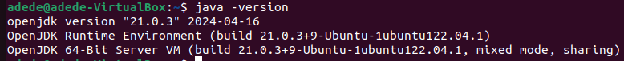

# Big Data News Recommender

## Description

The Big Data News Recommender is a system designed to provide personalized news recommendations using big data technologies. It processes large streams of news articles and user interaction data to suggest relevant news content to users.

## Table of Contents

- [Installation](#installation)
- [Kafka Setup](#kafka-setup)
- [Usage](#usage)
- [Contributing](#contributing)
- [License](#license)
- [Contact Information](#contact-information)
- [Acknowledgments](#acknowledgments)

## Installation

### Prerequisites
#### A Linux distribution
#### Python 3.x
#### pip

Check installation
```sh
pip --version
```
If not installed, install it

```sh
sudo apt install python3-pip
```

#### Java>=8

A version of Java newer or equal to 8 need to be installed.

We will need Java to build our Kafka source using Gradle, which works with at least Java 8.

Personally I used Java 21.

First of all check if you have Java 21 installed.

```sh
java -version
```

If you dont't have any version of Java installed use this command to install Java21

```sh
sudo apt install openjdk-21-jdk
```

Check your Java version

```sh
java -version
```


- If you have a version of Java greater than 8 and different from 21, go to the [Java-Gradle compatibility matrix](https://docs.gradle.org/current/userguide/compatibility.html) and note the Gradle version compatible with your Java version. 

- Otherwise, install Java21

#### Redis

We need Redis to store metadata in our application.

- Run the following commands to get Redis installed

```sh
sudo apt install curl
curl -fsSL https://packages.redis.io/gpg | sudo gpg --dearmor -o /usr/share/keyrings/redis-archive-keyring.gpg

echo "deb [signed-by=/usr/share/keyrings/redis-archive-keyring.gpg] https://packages.redis.io/deb $(lsb_release -cs) main" | sudo tee /etc/apt/sources.list.d/redis.list
sudo apt-get update
sudo apt-get install redis
```

- For other installation alternatives, go to [Redis installation on Linux](https://redis.io/docs/latest/operate/oss_and_stack/install/install-redis/install-redis-on-linux/).

#### Virtual Environment (recommended)

Install venv for virtual environments.

```sh
   sudo apt install python3-venv
```

### Steps

1. **Clone the repository:**

   ```sh
   git clone https://github.com/yourusername/Big-Data-News-Recommender.git
   cd Big-Data-News-Recommender
   ```

2. **Set up the virtual environment:**

   ```sh
   python3 -m venv big_data_env
   source big_data_env/bin/activate 
   ```

3. **Install the required packages:**

   ```sh
   pip install -r requirements.txt
   ```

## Kafka Setup

### Steps

1. **Download Kafka:**

   Download Kafka from [Apache Kafka Downloads](https://kafka.apache.org/downloads).

   Or use wget to download Kafka 3.7.0, which is the latest version of Kafka at the moment we are editing this file.

   ```sh
   wget https://downloads.apache.org/kafka/3.7.0/kafka-3.7.0-src.tgz
   ```

2. **Extract Kafka:**

   Extract the downloaded archive to your preferred directory. You can put it in your current working directory.

   ```sh
   tar -xvf kafka-3.7.0-src.tgz
   ```
   Then move to the extracted folder.

   ```sh
   cd kafka-3.7.0-src
   ```

3. **Build Kafka:**

   The Kafka source you've just installed needs to be built using Gradle. Do it with the following command.

   ```sh
   ./gradlew jar -PscalaVersion=2.13.12
   ```
   where 2.13.12 needs to be replaced with a Gradle version compatible with your Java. It will take some time. Just wait.

4. **Start Zookeeper:**

   Kafka requires Zookeeper to be running. Start Zookeeper with the following command:

   ```sh
   bin/zookeeper-server-start.sh config/zookeeper.properties
   ```

5. **Start Kafka:**

   Start a Kafka server with the following command:

   ```sh
   bin/kafka-server-start.sh config/server.properties
   ```
 
6. **Create a Kafka topic:**

   Create a Kafka topic named ***RawNewsTopic*** with 4 partitions and replication factor=1 (for now)

   using the following command:

   ```sh
   bin/kafka-topics.sh --bootstrap-server localhost:9092 --create --topic RawNewsTopic --partitions 2 --replication-factor 1
   ```

   - Kafka producers will retrieve news data using news API, and send it to that topic.

   - Kafka consumers will subscribe to that topic to retrieve the news sent by Kafka producers.

   - A spark streaming processor will retrieve the news in real-time, process them and send the processed news back to Kafka (to another Kafka topic).

   Use the following command to list the topics available. You should see ***RawNewsTopic*** listed.

   ```sh
   bin/kafka-topics.sh --bootstrap-server localhost:9092 --list
   ```

## Usage

1. **Start the Kafka and Redis servers.**

2. **Run the application:**

   - Start the producers:

     ```sh
     python3 producers/news_producer.py
     ```

   - Start the consumers:

     ```sh
     python3 consumers/news_consumer.py
     ```

   - Start the stream processors:

     ```sh
     python3 stream_processors/recommender.py
     ```

   Adjust the script paths based on your project's structure and scripts.

## Contributing

We welcome contributions! Please follow these steps:

1. Fork the repository.
2. Create a new branch: `git checkout -b feature-name`.
3. Make your changes and commit them: `git commit -m 'Add new feature'`.
4. Push to the branch: `git push origin feature-name`.
5. Submit a pull request.

Please make sure your code follows our coding guidelines and includes tests.

## License

This project is licensed under the MIT License. See the [LICENSE](LICENSE) file for details.

## Contact Information

For questions or issues, please contact:

- Name: Gbètoho Ezéchiel ADEDE
- Email: Gbetoho.ADEDE@um6p.ma
- GitHub: [Starias22](https://github.com/Starias22)
- LinkedIn: [Gbètoho Ezéchiel ADEDE](https://www.linkedin.com/in/Starias22)

## Acknowledgments

- Thanks to [contributor1](https://github.com/contributor1) for their valuable input.
