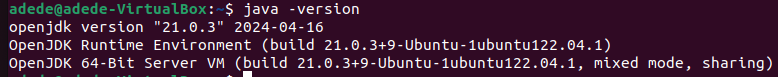

# Big Data News Recommender

## Description

The Big Data News Recommender is a system designed to provide personalized news recommendations using big data technologies. It processes large streams of news articles and user interaction data to suggest relevant news content to users.

## Table of Contents

- [Installation](#installation)
- [Kafka Setup](#kafka-setup)
- [Usage](#usage)
- [Contributing](#contributing)
- [License](#license)
- [Contact Information](#contact-information)
- [Acknowledgments](#acknowledgments)

## Installation

### Prerequisites
#### A Linux distribution
#### Python 3.x
#### pip

Check installation
```sh
pip --version
```
If not installed, install it

```sh
sudo apt install python3-pip
```

#### Java>=8

##### Installation

A version of Java newer or equal to 8 need to be installed.

We will need Java to build our Kafka source using Gradle, which works with at least Java 8.

Personally I used Java 21.

First of all check if you have Java 21 installed.

```sh
java -version
```

If you don't have any version of Java installed use this command to install Java21

```sh
sudo apt install openjdk-21-jdk
```

Check your Java version

```sh
java -version
```


- If you have a version of Java greater than 8 and different from 21, go to the [Java-Gradle compatibility matrix](https://docs.gradle.org/current/userguide/compatibility.html) and note the Gradle version compatible with your Java version. 

- Otherwise, install Java21

  For the following let us suppose you have installed. Java 21

##### Home configuration

Now that Java is instaled we need to set it as default and to configure the home path

1. Set Java 21 as default by running the following command, which will prompt you yo selet the Java version you want to select as the fault.

```sh
    sudo update-alternatives --config java
```

2. Now we will configure Java home path

In my case, this is the path to my Java21: /usr/lib/jvm/java-21-openjdk-amd64/

We will edit Java home in .bashrc file.

```sh
   nano .bashrc
```

Add the following line to your .bashrc

```sh
export JAVA_HOME=/usr/lib/jvm/java-21-openjdk-amd64/
```

Then save the file and exit.

Now apply the modification by executing the following command

```sh
   source .bashrc
```

3. Check Java version by running the command

```sh
   java -version
```

4. Check Java home path

 ```sh
   echo $JAVA_HOME
```

Java 21 should be your default Java now.


#### Redis

We need Redis to store metadata in our application.

- Run the following commands to get Redis installed

```sh
sudo apt install curl
curl -fsSL https://packages.redis.io/gpg | sudo gpg --dearmor -o /usr/share/keyrings/redis-archive-keyring.gpg

echo "deb [signed-by=/usr/share/keyrings/redis-archive-keyring.gpg] https://packages.redis.io/deb $(lsb_release -cs) main" | sudo tee /etc/apt/sources.list.d/redis.list
sudo apt-get update
sudo apt-get install redis
```

You can run `redis-cli` to check Redis installation and then  <kbd>Ctrl</kbd> + <kbd>D</kbd> to exit Redis CLI.

- For other installation alternatives, go to [Redis installation on Linux](https://redis.io/docs/latest/operate/oss_and_stack/install/install-redis/install-redis-on-linux/).

#### Virtual Environment (recommended)

Install venv for virtual environments.

```sh
   sudo apt install python3-venv
```

### Steps

1. **Clone the repository:**

   ```sh
   git clone https://github.com/Starias22/Big-Data-News-Recommender.git
   cd Big-Data-News-Recommender
   ```

2. **Set up the virtual environment:**

   ```sh
   python3 -m venv big_data_env
   source big_data_env/bin/activate 
   ```

3. **Install the required packages:**

   ```sh
   pip install -r requirements.txt
   ```

4. **Download the models folder***
Download the models zip file  from  [my drive](https://drive.google.com/drive/folders/1xyo_IqACn7A9cOo8sq9H2FeBptWwPM8y?usp=drive_link) , unzip it and put the extracted folder  in the current working directory(the repository)***

5. **Generate a NewsAPI key**

You need a NewsAPI key. You can generate one [here](https://newsapi.org/register).

After filling the requested information you will have a new key generated. Copy and paste it in a safe place.
5. **Set up your config.json file**

   Rename the file config/config_template.json to config/config.json and replace the value of the key "news_api_key" from "xxxxxxxxxxxxxxxxxxxxxxxxxxxxxxxx" to the key you have just generated.

## Kafka Setup

### Steps

1. **Download Kafka:**

   Download Kafka from [Apache Kafka Downloads](https://kafka.apache.org/downloads).

   Or use wget to download Kafka 3.7.0, which is the latest version of Kafka at the moment we are editing this file.

   ```sh
   wget https://downloads.apache.org/kafka/3.7.0/kafka-3.7.0-src.tgz
   ```

2. **Extract Kafka:**

   Extract the downloaded archive to your preferred directory. You can put it in your current working directory.

   ```sh
   tar -xvf kafka-3.7.0-src.tgz
   ```

   Now you can move the compressed file downloaded from the repository.

    ```sh
   mv kafka-3.7.0-src.tgz ..
   ```
   Then move to the extracted folder.

   ```sh
   cd kafka-3.7.0-src
   ```

4. **Build Kafka:**

   The Kafka source you've just installed needs to be built using Gradle. Do it with the following command.

   ```sh
   ./gradlew jar -PscalaVersion=2.13.12
   ```
   where 2.13.12 needs to be replaced with a Gradle version compatible with your Java. It will take some time. Just wait.

5. **Start Zookeeper:**

   Kafka requires Zookeeper to be running. Start Zookeeper with the following command:

   ```sh
   bin/zookeeper-server-start.sh config/zookeeper.properties
   ```

6. **Start Kafka:**

   Start a Kafka server with the following command:

   ```sh
   bin/kafka-server-start.sh config/server.properties
   ```
 
7. **Create Kafka topics:**

  a. **Explanation**
  
  - Kafka producers will retrieve news data using news API and google news API. They will then send them to a KafKa topic called ***RawNewsTopic***.
    
  - A spark streaming processor will suscribe to that topic to retrieve news in real-time.
     
       Then it will filter the news by removing duplicates and news without description, content or URL. Then it will save the filtered news to a database, process by doing tasks such as preprocessing(cleaning, tokennization, lemmatization, stop words removals), sentiment analysis, topic distribution and categorization of the news using their description. Then, it will send the processed news back to  Kafka, especiallly another Kafka topic called ***ProcessedNewsTopic***.

  - A Kafka consumer will subscribe to that topic to retrieve the preprocessed news and recommand them to the users according to their preferences.

  b. **Topic creation**
  
  -  Open a shell and create a Kafka topic named ***RawNewsTopic*** with 4 partitions and replication factor=1 (for now)

   using the following command:
   
   ```sh
   bin/kafka-topics.sh --bootstrap-server localhost:9092 --create --topic RawNewsTopic --partitions 4 --replication-factor 1
   ```
  - Open a new shell and create another Kafca topic called **ProcessedNewsTopic** . Use the following command to do it.

   ```sh
   bin/kafka-topics.sh --bootstrap-server localhost:9092 --create --topic ProcessedNewsTopic --partitions 4 --replication-factor 1
   ```
  c. **Check the topics list**
  
   Use the following command to list the topics available. You should see ***RawNewsTopic*** and ***ProcessedNewsTopic*** listed.

   ```sh
   bin/kafka-topics.sh --bootstrap-server localhost:9092 --list
   ```

## Usage

1. **Start the Kafka and Redis servers.**

2. **Run the application:**

   - Start the producers:

     ```sh
     python3 producers/news_producer.py
     ```

   - Start the consumers:

     ```sh
     python3 consumers/news_consumer.py
     ```

   - Start the stream processors:

     ```sh
     python3 stream_processors/recommender.py
     ```

   Adjust the script paths based on your project's structure and scripts.

## Contributing

We welcome contributions! Please follow these steps:

1. Fork the repository.
2. Create a new branch: `git checkout -b feature-name`.
3. Make your changes and commit them: `git commit -m 'Add new feature'`.
4. Push to the branch: `git push origin feature-name`.
5. Submit a pull request.

Please make sure your code follows our coding guidelines and includes tests.

## License

This project is licensed under the MIT License. See the [LICENSE](LICENSE) file for details.

## Contact Information

For questions or issues, please contact:

- Name: Gbètoho Ezéchiel ADEDE
- Email: Gbetoho.ADEDE@um6p.ma
- GitHub: [Starias22](https://github.com/Starias22)
- LinkedIn: [Gbètoho Ezéchiel ADEDE](https://www.linkedin.com/in/Starias22)

## Acknowledgments

- Thanks to [contributor1](https://github.com/contributor1) for their valuable input.
