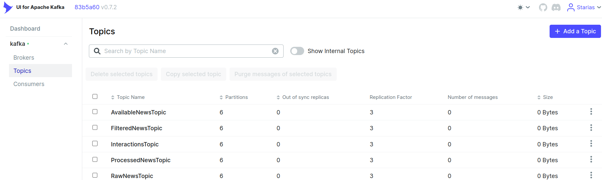

# Big Data News Recommender

## Description

The Big Data News Recommender is a system designed to provide personalized news recommendations using big data technologies. It processes large streams of news articles and user interaction data to suggest relevant news content to users.

## Table of Contents

- [Installation and Configurations](#installation-and-onfigurations)
  - [Prerequisites](#prerequisites)
  - [Clone the repository](#clone-the-repository)
  - [Download the trained models folder](#download-the-trained-models-folder)
  - [Download the necessary NLTK data](#download-the-necessary-nltk-data)
  - [Generate a NewsAPI key](#generate-a-newsapi-key)
  - [Email configuration](#email-configuration)
  - [Secret JSON file configuration](#secret-json-file-configuration)
  - [Docker compose file configuration](#docker-compose-file-configuration)
  - [Create Necessary Directories](#create-necessary-directories)
  - [Set Permissions](#set-permissions)
  - [Initialize Airflow](#initialize-airflow)
  - [Start All Services](#start-all-services)
  - [Access Kafka and create topics](#access-kafka-and-create-topics)
- [Usage](#usage)
  - [Run the raw news stream processor](#run-the-raw-news-stream-processor)
  - [Run raw news consumer](#run-raw-news-consumer)
  - [Run news producers](#run-news-producers)
  - [Run filtered news saver](#run-filtered-news-saver)
  - [Run the application](#run-the-application)
  - [Register a user](#register-a-user)
  - [Run processed news recommender](#run-processed-news-recommender)
  - [Navigation](#navigation)
- [Pipeline Overview](#pipeline-overview)
  - [Schema](#schema)
  - [Detailed Description](#detailed-description)
- [Reset](#reset)
- [Contributing](#contributing)
- [License](#license)
- [Contact Information](#contact-information)
- [Acknowledgments](#acknowledgments)

## Installation and Configurations

### Prerequisites
#### A Linux distribution
#### Python 3.x
#### pip
#### Docker and Docker Compose

### Clone the repository

   ```sh
   git clone https://github.com/Starias22/Big-Data-News-Recommender.git
   cd Big-Data-News-Recommender
   ```

### Download the trained models folder
   
Download the `trained_models` zip file  from  [my drive](https://drive.google.com/drive/folders/1qI7ojkrH3gJ3DySCI0V8ol_6k4VqXy8c?usp=sharing) , unzip it and put the extracted folder  in the current working directory(the repository)

### Download the necesssary NLTK data

NLTK is used to process the news description. You need to download the necessasy NLTK data. But firstly, NLTK needs to be installed.

1. **Set up a virtual environment:**

   ```sh
   python3 -m venv big_data_env
   source big_data_env/bin/activate 
   ```

2. **Install NLTK:**

   ```sh
   pip install nltk
   ```

3. **Download NLTK data:**

Run the following command to download the necessary NLTK data.

```python3
python3 download_nltk_data.py
```

You should have the necessary NLTK data downloaded into `nltk_data` folder of the project root.

4. **Check the downloaded data**

```bash
ls nltk_data/
```
You should see `corpora` and `sentiment` folders in the `nltk_data` folder.


### Generate a NewsAPI key

You need a NewsAPI key. You can generate one [here](https://newsapi.org/register).

After filling the requested information you will have a new key generated. Copy and paste it in a safe place.


### Email configuration

You need to configure a Google email address. This email address will be used to send One Time Password to users during registration. It will also be used by Airflow for email sending at the end of each task.

You have to create an app password. You can follow [this tutorial](https://itsupport.umd.edu/itsupport?id=kb_article_view&sysparm_article=KB0015112) to do it.

By the end of this step, you should have an app password created. Copy and store it in a safe place.


### Secret JSON file configuration

You need to configure your secret.json file.

First of all make a copy of the secret JSON template

```bash
cp config/secret_template.json config/secret.json
```

In the `secret.json` file replace the value of  the

- `newsapi_key`  field by the NewsAPI key you've generated above.

- `sender_address` field by the Google email address you used to generate app password in the previous step

- `password` field by the app password you've generated in the above

- `admin_email` field by the admin email. The admin email is the mail address airflow send task execution informations to using the `sender_address`  Google email address. 

### Kafka-ui config file

You need to personalize the Kafka UI config file. This is required by the Kafka UI to work.

First of all make a copy of the `kafka-ui/config_template.yml`.

```bash
cp kafka-ui/config_template.yml kafka-ui/config.yml
```

Then set your username and password in the `kafka-ui/config.yml`. You will use them to sign in into Kaka UI.

### Docker compose file configuration

You need to configure your `docker-compose.yml` file.

- First of all make a copy of the docker compose template

```bash
cp docker-compose-template.yml docker-compose.yml
```

- Open the `docker-compose.yml` file 

- Go to the  the airlow environment block ie 

`x-environment: &airflow_environment` and replace

1. the value of the `AIRFLOW__SMTP__SMTP_USER` and `AIRFLOW__SMTP__SMTP_MAIL_FROM` variables by the Google email address, your email sender address

2. the value of the `AIRFLOW__SMTP__SMTP_MAIL_FROM` variable by the app password you've generated


- Go to the  the airlow initialization service  ie 

`airflow-init` and replace the email address by the admin email address. Use the same email address as the value you set for  `admin_email` during the configuration of `the secret.json` file.

You should also set your username and password.

You may also want to set your firstname and lastname.

#### Create Necessary Directories

First, create a `data` directory and navigate into it. Within the `data` directory, create subdirectories for Zookeeper, Kafka brokers, checkpoints, Redis, PostgreSQL, and MongoDB. Additionally, create a directory for Airflow logs.

```bash
# Create the main data directory and navigate into it
mkdir data
cd data

# Create directories for Zookeeper
mkdir -p zookeeper/data/
mkdir -p zookeeper/log/

# Create directories for Kafka brokers
mkdir -p kafka/log/broker1/
mkdir -p kafka/log/broker2/
mkdir -p kafka/log/broker3/

# Create directories for checkpoints
mkdir -p checkpoint/filtered_news/
mkdir -p checkpoint/available_news/
mkdir -p checkpoint/processed_news/

# Create directory for Redis
mkdir redis/

# Create directory for PostgreSQL
mkdir postgres

# Create directory for MongoDB
mkdir mongodb/

# Create directory for Airflow logs
mkdir airflow-logs/

# Navigate back to the parent directory
cd ..
```

### Set Permissions

Set appropriate permissions for the created directories to ensure that the services can read from and write to these directories. Zookeeper and Kafka directories will have full permissions (777), while Redis, PostgreSQL, and MongoDB directories will have read, write, and execute permissions for the owner and read and execute permissions for others (755).

```bash
# Set permissions for Zookeeper directories
chmod -R 777 data/zookeeper/data/
chmod -R 777 data/zookeeper/log/

# Set permissions for Kafka broker directories
chmod -R 777 data/kafka/log/broker1/
chmod -R 777 data/kafka/log/broker2/
chmod -R 777 data/kafka/log/broker3/

# Set permissions for checkpoint directories
chmod -R 777 data/checkpoint/filtered_news/
chmod -R 777 data/checkpoint/available_news/
chmod -R 777 data/checkpoint/processed_news/

# Set permissions for Redis directory
chmod -R 755 data/redis/

# Set permissions for PostgreSQL directory
chmod -R 755 data/postgres/

# Set permissions for MongoDB directory
chmod -R 755 data/mongodb/

# Set permissions for Airflow logs directory
chmod -R 777 data/airflow-logs/
```

### Initialize Airflow

 Before starting the full Docker Compose setup, initialize Airflow. This step ensures that the necessary database migrations and initial setup are completed. Tipically, this creates an initial airflow user.

 ```bash
 docker compose up airflow-init -d
 ```

Acess airflow-init logs and assure that the intitialization was sucessful.


 ### Start All Services

```bash
docker compose up -d
```

### Acess Kafka and create topics

#### Acess kafka-brocker 1

```bash
docker exec -it kafka-broker1 bash
```

#### Create the topics

```bash
/scripts/create_topics.sh 
```
 
#### Describe the topics (Optional)

You can describe the topics by running the following command.

```bash
/scripts/describe_topics.sh
```

### Check topics creation

Go to Kafka UI to check the topics creation

Kafka UI is accessible via [localhost:7070](http://localhost:7070).

You should see  a login page


Fill your login informations, those you set in your kafka-ui/config.yml file.

After logging in, you should see something like the following image, after cliccking on **Topics**



### Acess Spark master

You can acess Spark master via [localhost:9090](http://localhost:9090).

You should see the three Spark workers alive.


### Configure start hour and start days ago

You need to configure two variables in the config/config.py file.

- `START_HOUR`: This is the hour you need the news production start. I should be in [0-20]

In our case we set `START_HOUR` to 2 since we need our news production to starts at 2 AM. You may do the same for now.

- `START_DAYS_AGO`: The value of this variable depends on the day you want to DAGs start running, at the specified  `START_DAYS_AGO`, and should be less than or equal to 0. For exaple if you want it to run
  - the currrent day, set it to 1
  - tomorrow ie in one(1) day, set it to 0
  - in two(2) days, set it to -1 
  - in three(3) days, set it to -2
  - in four(4) days, set it to -3
  - in $n$ days, set it to $-(n-1)$


### Acess  airflow-webserver

Go to airflow-webserver. It is  is accessible via [localhost:8080](http://localhost:8080)


On the logging page provide the logging informations you set in the airflow initialization command in the docker-compose.

#### Configure connection to Spark cluster

We need to create a connection to our Spark cluster in the Airflow admin. This allows Airflow to run some tasks using the Spark cluster.

On airflow webserver, go to Admin->connections


You should see this page


Then click on the **Add a new record button**, ie the plus button. You will be redirected to the following page.


You then need to fill the fields to get the connection created. 

As you can see, the **connection id** and the **connection type** are required

Set the connection id to spark-connection and the connection type to Spark


Two more fielda are available now and should be filled. There are the ***Host*** and the ***Port***.

Set the host to `spark://spark-master` and the port to `7077`, as done in the figure below. The description field is optional. 

Click on the save button 


You should see something like


### Access DAGs

Click on DAGs to access DAGs


 As you can see in the figure below there are four DAGs

 


### Activate the DAGs

Currently, the DAGs are paused. They wont never be executed until you active them

For each DAG, click on the ***Pause/Unpause DAG*** toggle to get it activated.

 


Now everything is ready.

## Usage

### Trigger DAGs 


### Run the raw news stream processor

Run spark raw news stream processor.

The raw news stream processor:

- Gets news messages from **RawNewsTopic**
- Filters the news to remove news without URL, content or description and also duplicate news
- Sends the filtered news to **FilteredNewsTopic**
- Preprocesses the filtered news by performing cleaning, tokennization, lemmatization and stopwords removal
- Processes the preprocessed news by performing sentiment analysis, topic detection and categorization on the description field of the news
- Send the processed news to **ProcessedNewsTopic**

```sh
   python3 raw_news_stream_processor.py
```

### Run raw news consumer

Move to src/consumer and run raw news consumer.

```sh
python3 raw_news_consumer.py
```

This etrieves raw news messages from **RawNewsTopic**

### Run news producers 

Keep the raw news stream processor running and open another window.

To run news producers, move to scr/producers and run the following commands

 ```sh
   python3 news_api_producer.py
```

 ```sh
   python3 google_news_producer.py
```

These news producers will retrieve news using News API and Gooogle news and then send them to **RawNewsTopic**

As news messages arrivse, the raw news stream processor will be processing them.


### Run filtered news saver

Move to src/consumer and run filtered news saver.

```sh
python3 filtered_news_saver.py
```

This retrieves filtered news messages from **FilteredNewsTopic** and insert them into the collection **filtered_news** of the **news_recommendation_db** in MongoDB.

You can run the following command in mongosh to check the inserted filtered news

1. Open a mongo shell using mongosh

   ```sh
   mongosh
   ```

2. Switch to **news_recommendation_db**

   ```sh
    use news_recommendation_db
   ```

3. Show the collections available

```sh
   show collections
```

   You should see `filtered_news` listed.

4. List all filtered news

   ```sh
    db.filtered_news.find()
   ```

### Run the application

Move to the root directory of the project and execute the following command to run the application.

```sh
   streamlit run app.py
```

### Register a user

Register at least one user with a valid email address and confirm the verification code.

### Run processed news recommender

Move to src/consumer and run the following command.

```sh
python3 processed_news_recommender.py
```

The processed news recommender retrieves processed news messages from **ProcessedNewsTopic** and recommend them to each user in the users collection based on their preferences of categories, sentiments and similarities with already seen news.

### Navigation
 Now go the the application web page, login to an user account created above and see the recommended news.


## Pipeline Overview

### Schema
            
### Detailed Description

1. **News Producers**:
    - **Sources**: News articles are fetched from various sources such as NewsAPI and Google News.
    - **Kafka Topic**: These news articles are published to the `RawNewsTopic` Kafka topic.

2. **Raw News Stream Processor**:
    - **Task**: The processor reads raw news from the `RawNewsTopic`, filters out articles without URLs, content, or descriptions, and removes duplicates.
    - **Output**: Filtered news is then published to the `FilteredNewsTopic`.
    - **Preprocessing**: Additionally, it performs text preprocessing such as cleaning, tokenization, lemmatization, and stopwords removal.
    - **Processing**: It conducts sentiment analysis, topic detection, and categorization of the news articles.
    - **Kafka Topic**: Processed news articles are published to the `ProcessedNewsTopic`.

3. **Filtered News Saver**:
    - **Task**: This component consumes messages from the `FilteredNewsTopic` and saves the filtered news articles to a MongoDB collection `filtered_news`.

4. **Processed News Recommender**:
    - **Task**: This component consumes messages from the `ProcessedNewsTopic` and generates personalized news recommendations for users based on their preferences (categories, sentiments) and similarities with previously seen news.
    - **Output**: Recommendations are then sent to each user's profile, making them available for viewing on the application.

## Reset

In case you want to reset everything, follow the steps desribed [here](./RESET.md)
## Contributing

We welcome contributions! Please follow these steps:

1. Fork the repository.
2. Create a new branch: `git checkout -b feature-name`.
3. Make your changes and commit them: `git commit -m 'Add new feature'`.
4. Push to the branch: `git push origin feature-name`.
5. Submit a pull request.

Please make sure your code follows our coding guidelines and includes tests.

## License

This project is licensed under the MIT License. See the [LICENSE](LICENSE) file for details.

## Contact Information

For questions or issues, please contact:

- Name: Gbètoho Ezéchiel ADEDE
- Email: Gbetoho.ADEDE@um6p.ma
- GitHub: [Starias22](https://github.com/Starias22)
- LinkedIn: [Gbètoho Ezéchiel ADEDE](https://www.linkedin.com/in/Starias22)

## Acknowledgments

- Thanks to [contributor1](https://github.com/contributor1) for their valuable input.

                
